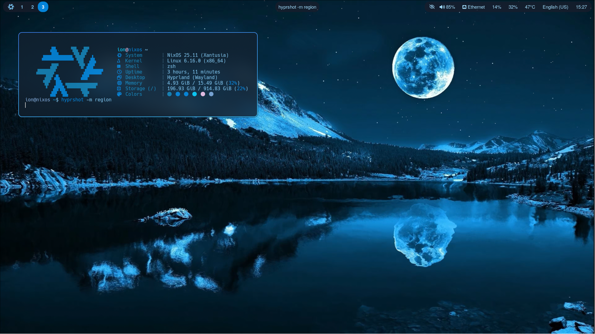
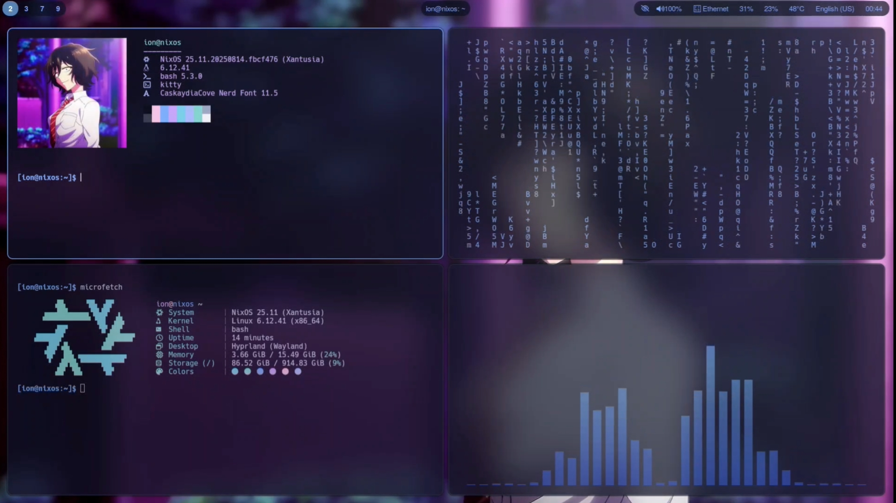

# 🌌 My Hyprland Config (outdated, remaking with NixOS flakes)

Hello! These are my **personal configuration files** for **Hyprland** with Waybar, Rofi, Kitty, Neofetch, Cava, and other tools.
⚠️ **Warning:** this setup is tailored for my hardware — especially display resolutions and file paths.
Before using, **double-check all settings** to avoid issues.

---

## ✨ Screenshots

**Theme 1**


**Theme 2**


---

## 📁 Repository Structure

```
.
├── 1theme/   # First theme (Hyprland, Waybar, Rofi, etc.)
├── 2theme/   # Second theme
└── ...       # Other files
```

---

## ⚡ Usage

Copy the desired theme into `~/.config/`:

```bash
cp -r 1theme/* ~/.config/
```

💡 **Tip:** always back up your current configs before overwriting.

---

## 🛠 Requirements

* 🖥 [Hyprland](https://hyprland.org) – Window manager
* 📊 [Waybar](https://github.com/Alexays/Waybar) – Status bar
* 🐱 [Kitty](https://sw.kovidgoyal.net/kitty/) – Terminal emulator
* 🎨 [Rofi](https://github.com/davatorium/rofi) – App launcher
* 📟 [Neofetch](https://github.com/dylanaraps/neofetch) – System info tool
* 🔊 [Cava](https://github.com/karlstav/cava) – Audio visualizer

---

## ⚠ Important Notes

* Check **display resolutions**, **paths**, and **other system-specific settings** before applying.
* Some configs may not work out of the box on a different setup.
* Recommended: test one component at a time (Hyprland → Waybar → Rofi, etc.).

---
